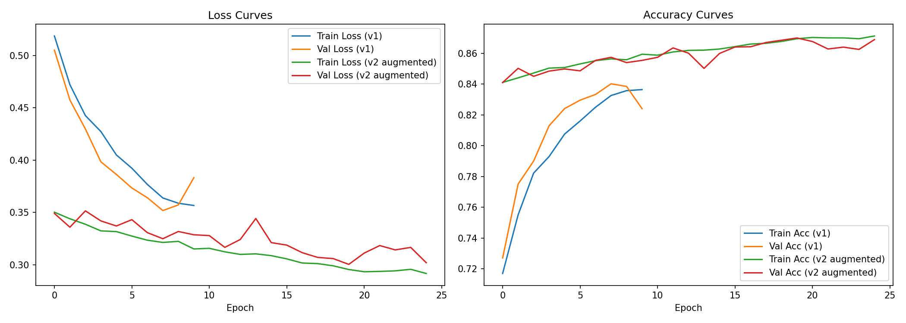
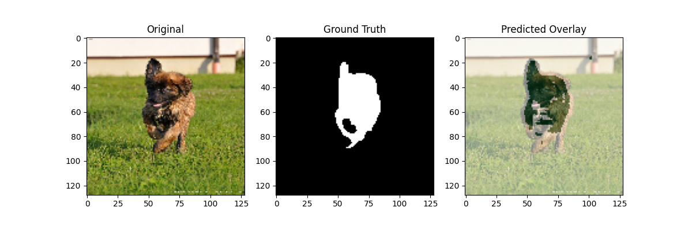
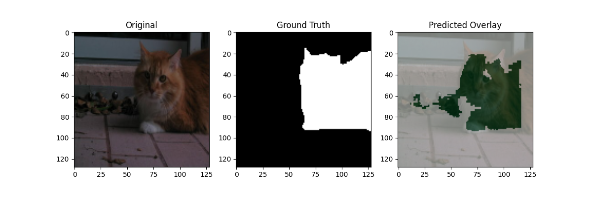
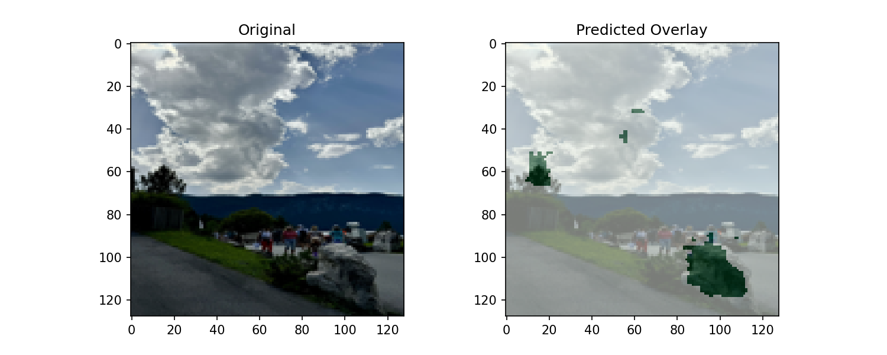
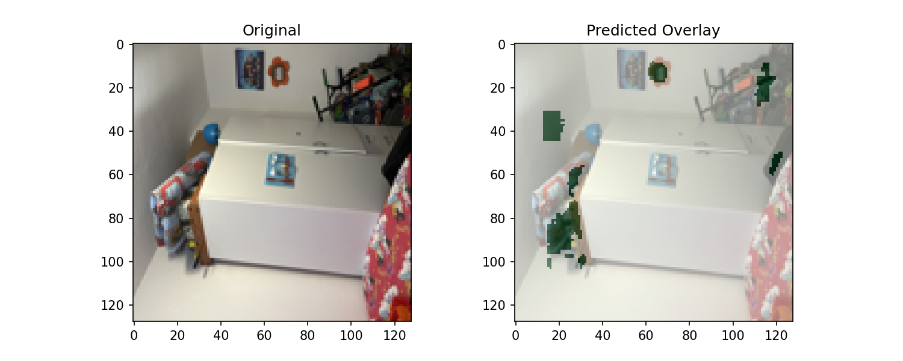

# U-Net Pet Segmentation

Binary semantic segmentation of pets using a U-Net trained on the Oxford-IIIT Pet Dataset.

## Results
- **Accuracy:** 87%
- **Mean IoU:** 0.61
- **Dataset:** Oxford-IIIT Pet (3,680 train / 3,669 test)
- **Training:** 25 epochs with data augmentation on T4 GPU

## Training Curves

## Validation Results

## Custom Image Results

